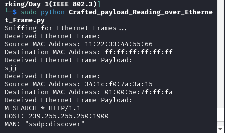

# Networking With Scapy 👋


## Project Description
Welcome to Networking With Scapy, a Python project focused on studying and implementing various networking layers using Scapy. This project aims to provide a hands-on learning experience in networking protocols and packet manipulation techniques.

### Motive
The primary goal of this project is to deepen understanding and practical skills in networking by exploring different layers of the OSI model and implementing them using Scapy. By leveraging Scapy's capabilities, we can craft, send, receive, and analyze packets at different network layers, enabling us to grasp fundamental concepts more effectively.

#### Instructions
1. Ensure you have Scapy installed. If not, you can install it via pip:

    ```
    pip install scapy
    ```

## Day 2


# Sending Payload using Scapy over Ethernet

This Python script demonstrates how to use Scapy to craft and send Ethernet frames with a custom payload.


```python
from scapy.all import Ether, sendp, Raw

# Asking user for payload
user_input = input("Enter Payload: ")

# Encoding the string to bytes
payload_data = user_input.encode()

# Crafting Ethernet Frame with Payload
ether_frame = Ether(dst="ff:ff:ff:ff:ff:ff", src="11:22:33:44:55:66") / Raw(load=payload_data)

# Print Ethernet Frame Summary
print("Ethernet Frame Summary:")
print(ether_frame.summary())

# Sending the Ethernet Frame
sendp(ether_frame, iface="eth0")
```
## Code Explanation
User Input: The script prompts the user to enter a payload message.\

Encoding Payload: The user-provided message is converted into bytes so it can be sent over the network.\

Crafting Ethernet Frame: An Ethernet frame is created with the following details:\

Destination MAC address: Set to broadcast (ff:ff:ff:ff:ff:ff), indicating that the frame should be delivered to all devices on the network.\
Source MAC address: A custom MAC address (11:22:33:44:55:66) is used to identify the sender.\
Payload: The encoded user input is set as the payload of the Ethernet frame.\
Printing Summary: The script prints a summary of the crafted Ethernet frame.\

Sending Frame: Finally, the Ethernet frame is sent over the network interface (eth0).

# Sniffing Payload using Scapy over Ethernet

## Introduction

This Python script demonstrates how to use Scapy to sniff  Ethernet frames with a custom payload.

```python
# Importing Scapy
from scapy.all import sniff, Ether, Raw

# Define a callback function to handle incoming packets
def packet_handler(packet):
    if packet.haslayer(Ether) and packet.haslayer(Raw):
        # Extract the source and destination MAC addresses
        src_mac = packet[Ether].src
        dst_mac = packet[Ether].dst
        # Extract the payload from Ethernet Frame
        payload = packet[Raw].load
        
        # Attempt to decode the payload
        try:
            decoded_payload = payload.decode('utf-8')
            print(f"Destination MAC Address: {dst_mac}")
            print("Received Ethernet Frame Payload:")
            print(decoded_payload)
        except UnicodeDecodeError:
            print("Received Ethernet Frame with Non-UTF-8 Payload:")
            print("Error Source MAC Address:", src_mac)

# Start sniffing for Ethernet frames on the specified interface
print("Sniffing for Ethernet Frames...")
sniff(prn=packet_handler, count=25, iface="eth0")
```

## Code Explanation

The function extracts source and destination MAC addresses from Ethernet frames.\
It attempts to decode the payload using UTF-8 encoding.\
If successful, it prints the destination MAC address and the decoded payload.\
If decoding fails (due to a non-UTF-8 payload), it prints an error message with the source MAC address;

## Screenshot




## 🤝 Contributing

Contributions, issues and feature requests are welcome!


## Show your support

Give a ⭐️ if this project helped you!
